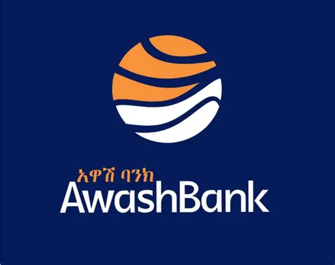

# Awash Bank Fraud Detection & Risk Analytics Platform
- LiveDashboard Link: (https://awash-bank-fraud-analytics-ak6kjycnmdbo3thyrh2enf.streamlit.app/)

**An interactive fraud monitoring and real-time risk prediction dashboard simulating operations at Awash Bank S.C., Ethiopia's leading private commercial bank.**

This portfolio project demonstrates end-to-end data analytics, machine learning, and BI development skills through a production-ready fraud detection system.

## Project Overview

The platform provides comprehensive fraud insights across Awash Bank's nationwide branch network and digital channels (AwashBirr mobile transfer, ATM, POS, agent banking, bill payment, etc.) using a realistic synthetic dataset modeled on actual Ethiopian banking patterns.

### Key Achievements
- **Synthetic Dataset Generation**: Created ~10,000 customers and ~100,000 transactions with authentic Ethiopian details:
  - Names, phone numbers, and real branch locations (Bole, Dire Dawa, Gondar, Mekelle, etc.)
  - Transaction channels, merchants, locations, and amounts in ETB
  - Engineered realistic fraud patterns (location mismatch, high-value transactions, off-hour activity)
- **Exploratory Data Analysis (EDA)**: Identified key fraud indicators through univariate, bivariate, and multivariate analysis (fraud rate by channel, hour, amount, location mismatch).
- **Machine Learning Model**: Trained a Random Forest classifier achieving high recall on fraudulent transactions using engineered features (amount, hour, channel encoding, location mismatch, high-amount flag).
- **Interactive Streamlit Dashboard** (multi-page):
  - **Overview Dashboard**: Key metrics (total transactions, fraud cases, amount at risk) with visualizations for fraud rate by channel and top 15 risky branches
  - **Fraud Explorer**: Fully filterable transaction table (channel, branch) with "show only fraud cases" option
  - **Real-Time Fraud Predictor**: Input new transaction details for instant fraud probability and risk factor explanation

## Features
- Real-time fraud risk scoring with probability and key factor breakdown
- Fraud rate analysis by transaction channel and home branch
- Interactive filtering and exploration of historical transactions
- Professional, bank-themed UI with high-contrast text and responsive design

## Tech Stack
- **Python** – Core language
- **Pandas & Faker** – Data generation and processing
- **scikit-learn & joblib** – Fraud detection model
- **Matplotlib & Seaborn** – Data visualizations
- **Streamlit** – Interactive web application

## Project Structure
